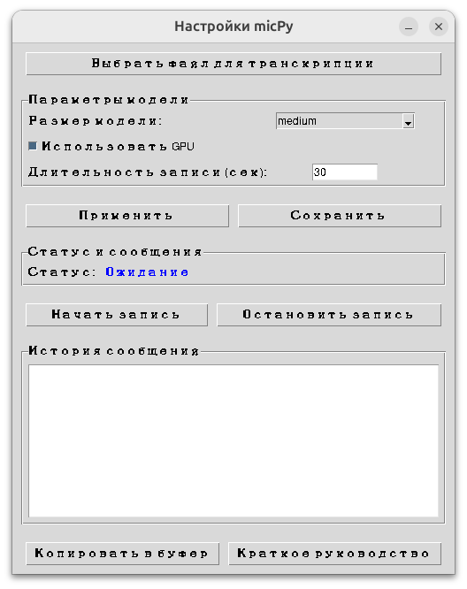

# micPy

**Аудиозапись с микрофона с распознаванием речи через Whisper и графическим интерфейсом**

Приложение для записи аудио с микрофона, использующее звуковые эффекты (pop-alert.wav и pop-long.wav), предотвращающее запуск нескольких экземпляров, с распознаванием речи через Whisper, копированием и автоматической вставкой результата, а также с удобным графическим интерфейсом для управления и настройки.

---

## 🚀 Установка

1. Клонируйте репозиторий:
   ```bash
   git clone https://github.com/Genajoin/micPy.git
   ```
2. Создайте virtualenv (рекомендуется):
   ```bash
   python -m venv venv
   source venv/bin/activate  # Linux/MacOS || venv\Scripts\activate  # Windows
   ```
3. Установите все зависимости одной командой:
   ```bash
   pip install -r requirements.txt
   ```

---

## 📱 Использование

Запустите приложение:
```bash
python main.py
```

### Транскрипция аудиофайла (CLI)

Для распознавания текста из готового аудиофайла (wav, mp3, flac и др.) используйте:
```bash
python main.py --file путь/к/вашему/файлу.mp3
```
Результат будет выведен в консоль и скопирован в буфер обмена.

### Графический интерфейс



- При запуске открывается окно с настройками:
  - выбор размера модели Whisper,
  - переключатель использования GPU,
  - настройка максимально длительности записи при использовании быстрых клавиш,
  - статус работы (ожидание, запись, распознавание),
  - история последних сообщений,
  - окно текущего сообщения,
  - кнопки: "Начать запись", "Остановить запись", "Копировать в буфер", "Применить", "Сохранить", "Краткое руководство", **"Выбрать файл для транскрипции"**.
    - Кнопка "Выбрать файл для транскрипции" позволяет выбрать любой поддерживаемый аудиофайл (wav, mp3, flac и др.), распознать его и сразу получить текст.

- Все параметры сохраняются между сессиями (settings.json). Для применения изменений требуется перезагрузка приложения.

### Режимы управления

- **Ручной режим**: используйте кнопки "Начать запись" и "Остановить запись" — запись не ограничена таймером.
- **Автоматический режим**: используйте горячие клавиши:
  - **Ctrl + PrintScreen** — начать (максимальная длительность из настроек) или остановить запись.
  - **Ctrl + Ctrl + PrintScreen** — завершить работу программы.

### Процесс работы

- При запуске активируется окно и слушатель клавиш.
- При старте записи (кнопкой или клавишей):
  - проигрывается звук `pop-long.wav`,
  - начинается запись аудио с микрофона.
- Запись длится до остановки вручную или по таймеру (в автоматическом режиме).
- Для транскрипции готового файла используйте кнопку "Выбрать файл для транскрипции" в окне или аргумент --file в командной строке.
- После окончания:
  - аудио сохраняется во временный файл `.wav`,
  - передается в модель Whisper для распознавания речи,
  - распознанный текст копируется в буфер обмена,
  - автоматически вставляется в активное окно (эмулируется Ctrl+V),
  - проигрывается звук `pop-alert.wav`,
  - результат и история отображаются в интерфейсе.

---

## 🧠 Использование Whisper

- Используется модель **Whisper** от OpenAI.
- Размер модели и использование GPU настраиваются через интерфейс.
- Для работы требуется установленный whisper и torch.

---

## 📂 Структура проекта

- `main.py` — основной файл запуска, интеграция GUI и логики.
- `settings_gui.py` — графический интерфейс на Tkinter.
- `audio_recorder.py` — класс для управления записью и распознаванием.
- `single_instance.py` — предотвращение запуска нескольких копий.
- `settings.json` — сохранённые настройки пользователя.
- `pop-alert.wav`, `pop-long.wav` — звуковые эффекты.
- `requirements.txt` — зависимости.

---

## 📋 Зависимости

- `pyaudio`
- `soundfile`
- `whisper`
- `torch`
- `pyperclip`
- `pynput`
- `tkinter` (стандартная библиотека Python)
- стандартные библиотеки Python: threading, io, os, time, atexit, signal, logging

---

## 🛠️ Инструменты и библиотеки
[](https://github.com/Genajoin/micPy/actions)
[](https://www.codefactor.io/repository/github/Genajoin/micPy)

---

## 👤 Авторы

- [Истомин Евгений]

---

## 📜 Лицензия

MIT License © 2025